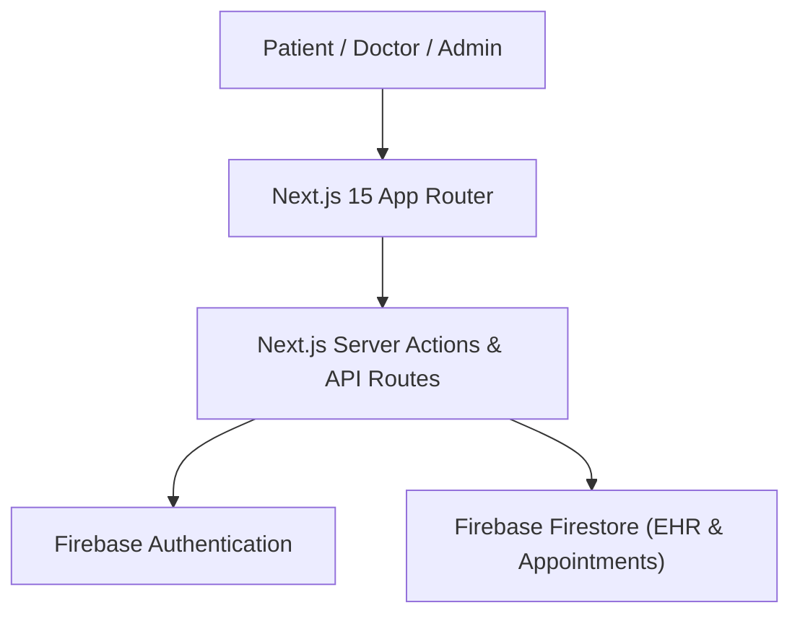
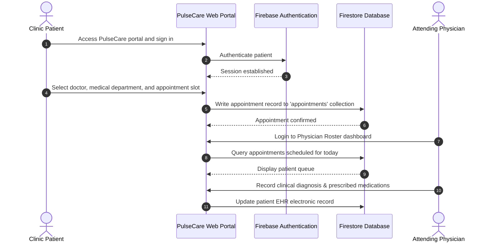

# PulseCare — Comprehensive Hospital & Clinic Management Platform
[]()
[]()
[]()
[]()

## Overview
PulseCare is an enterprise healthcare management system built with Next.js 15, Tailwind CSS, and Firebase. Engineered to modernize hospital operations, PulseCare integrates doctor scheduling, patient clinical records, department telemetry, and administrative dashboards into a single accessible portal.

- **Problem Solved:** Disjointed clinical scheduling, delayed patient record retrieval, and administrative overhead in outpatient clinics.
- **Target Users:** Hospital administrators, doctors, triage nurses, and patients.
- **Current Status:** Functional Healthcare MVP.

## Features
- **Hospital Administration Dashboard:** Overview of inpatient bed occupancy, appointment volumes, and emergency cases.
- **Doctor Consultation Scheduling:** Patient appointment booking with doctor availability slots.
- **Electronic Health Records (EHR):** Secure patient history, prescription logging, and clinical diagnosis notes.
- **Firebase Authentication:** Multi-role identity handling for Patients, Doctors, and Administrators.

## Architecture


## User Flow


## Technology Stack
| Layer | Technology | Purpose |
|---|---|---|
| Framework | Next.js 15 (App Router) | Enterprise React application framework |
| Language | TypeScript | Type safety and medical domain schemas |
| UI & Icons | Tailwind CSS, Radix UI, Lucide | Clean medical UI and accessible primitives |
| Backend & Auth | Firebase Auth & Firestore | Secure identity and NoSQL document store |

## Infrastructure
- **Server Port:** 3000
- **Cloud Backend:** Google Firebase Services

## Project Structure
```text
health/
├── src/
│   ├── app/             # Next.js App Router (appointments, admin, doctors, patients)
│   ├── components/      # MedicalCard, AppointmentCalendar, PatientTable
│   ├── context/         # AuthContext and role checking
│   ├── firebase/        # config.ts (Externalized Firebase initialization)
│   └── lib/             # Utility and formatting helpers
├── package.json         # Dependencies
├── next.config.ts       # Next.js configuration
├── .env.example         # Environment variables template
├── .gitignore           # Git ignore definitions
└── README.md            # Technical documentation
```

## Prerequisites
- Node.js >= 18.x
- npm >= 9.x
- Firebase project with Firestore and Authentication enabled

## Environment Variables
Create `.env.local` using placeholders:
```env
NEXT_PUBLIC_FIREBASE_API_KEY=your_firebase_api_key
NEXT_PUBLIC_FIREBASE_PROJECT_ID=your_firebase_project_id
NEXT_PUBLIC_FIREBASE_APP_ID=your_firebase_app_id
NEXT_PUBLIC_FIREBASE_AUTH_DOMAIN=your_project.firebaseapp.com
NEXT_PUBLIC_FIREBASE_MESSAGING_SENDER_ID=your_sender_id
```

## Local Development Setup
1. Clone the repository:
   ```bash
   git clone https://github.com/Bhanutejanallamothu/health.git
   cd health
   ```
2. Install dependencies:
   ```bash
   npm install
   ```
3. Set up environment variables:
   ```bash
   cp .env.example .env.local
   ```
4. Start development server:
   ```bash
   npm run dev
   ```
5. Navigate to `http://localhost:3000`.

## Docker Setup
*Not detected in repository. Standard Next.js standalone containerization supported.*

## Database Setup
Firestore collections:
- `appointments` - Scheduled consultation visits.
- `patients` - Demographic and medical history files.
- `doctors` - Staff roster, specializations, and working hours.

## API Documentation
- `POST /api/appointments` - Book a consultation slot.
- `GET /api/doctors` - Retrieve doctors list and specializations.

## Deployment
Build and deploy to Vercel or Firebase App Hosting:
```bash
npm run build
```

## Security
- API keys externalized to environment variables.
- Role-based route guarding preventing patient access to administrative panels.
- Sanitized input fields to prevent XSS in clinical notes.

## Testing
```bash
npm run lint
```

## Troubleshooting
- **Firebase Permission Error:** Ensure Firestore Security Rules grant read/write access to authenticated users.

## Future Improvements
- Telemedicine video consultation via WebRTC.
- Integration with FHIR / HL7 clinical interoperability standards.

## License
Healthcare management project. All rights reserved by repository owner.
